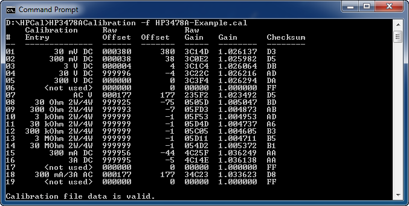

# HP 3478A Calibration Utility

A command line utility that reads, writes and verifies HP 3478A meter calibration data via GPIB.

Offsets and gains are displayed for each calibration entry/meter range.



## Supported Hardware

This utility supports [Prologix GPIB-USB](http://prologix.biz/gpib-usb-controller.html) compatible controllers
including the Galvant Industries [GPIBUSB rev4](http://www.galvant.ca/#!/store) with [firmware version 6](https://github.com/steve1515/gpibusb-firmware).

## Utility Details

```
NAME
    HP3478ACalibration

SYNOPSIS
    HP3478ACalibration -f FILE [-o]
    HP3478ACalibration -f FILE -r ADDR [-o]
    HP3478ACalibration -f FILE -w ADDR [-o]
    HP3478ACalibration -h

DESCRIPTION
    HP3478ACalibration reads, writes and verifies HP 3478A meter calibration
    data. Reading and writing of the calibration data is performed using a
    Prologix GPIB-USB compatible adapter.

OPTIONS
    -f FILE, --file=FILE
        Use FILE as the calibration file. The calibration file is verified for
        correctness when both the -r and -w options are not specified.

    -o, --allow-oversize
        Allow calibration files larger than 256 bytes to be read. (Only the
        first 256 bytes of the calibration file will be used when this
        option is specified.)

    -r ADDR, --read=ADDR
        Read calibration data from the instrument with GPIB address ADDR
        into the calibration file specified by -f. (This option cannot be
        specified with option -w.)

    -w ADDR, --write=ADDR
        Write calibration data from the calibration file specified by -f to
        the instrument with GPIB address ADDR. (This option cannot be
        specified with option -r.)

    -h, --help
        Display this help.
```

**Examples:**

Read calibration from meter at GPIB address 23 to file:\
`HP3478ACalibration -f file.cal -r 23`

Write calibration from file to meter at GPIB address 23:\
`HP3478ACalibration -f file.cal -w 23`

Verify a calibration file and display offsets/gains:\
`HP3478ACalibration -f file.cal`

## Configuration File

Serial port and GPIB adapter settings may be configured by editing the `HP3478ACalibrationSettings.xml` file.

```xml
<?xml version="1.0" encoding="utf-8" ?>

<Settings>
  
  <!--Serial Port Settings-->
  <SerialPort>
    <PortName>COM5</PortName>
    <BaudRate>460800</BaudRate>
    <DataBits>8</DataBits>
    <Parity>None</Parity> <!--Parity = None, Odd, Even, Mark, Space-->
    <StopBits>One</StopBits> <!--StopBits = One, OnePointFive, Two-->
    <FlowControl>None</FlowControl> <!--FlowControl = None, RequestToSend, RequestToSendXOnXOff, XOnXOff-->
  </SerialPort>
  
  <!--GPIB Adapter Settings-->
  <GPIBAdapter>
    <Timeout>1000</Timeout> <!--Serial/GPIB Timeout (mSec)-->
    <VersionString>GPIB</VersionString> <!--Command '++ver' return value must contain this string.-->
  </GPIBAdapter>
  
</Settings>
```

## License
This code is released under the [MIT license](LICENSE).
